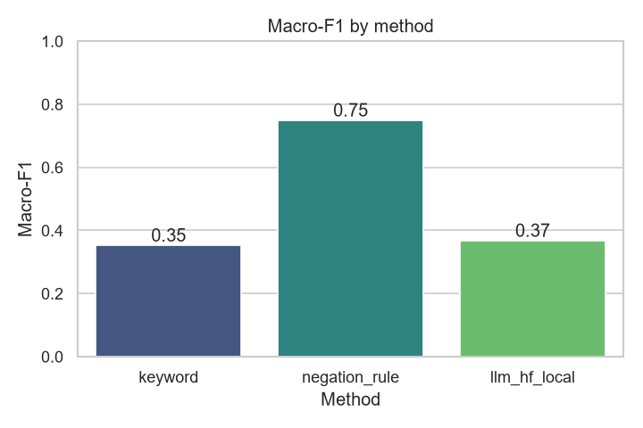
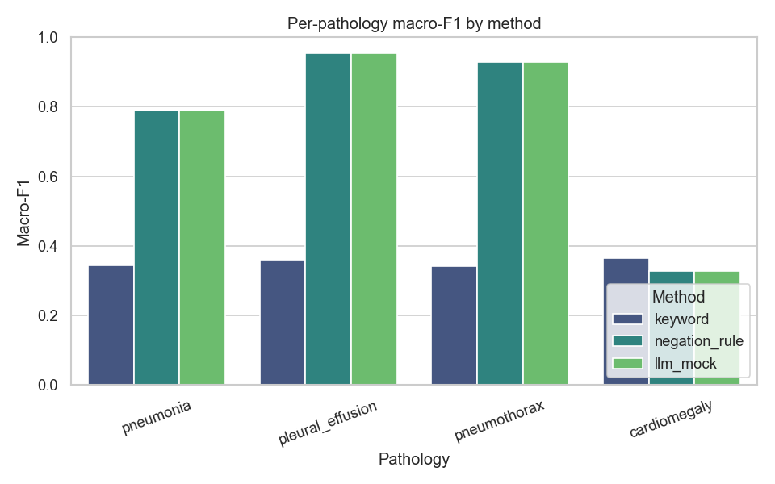
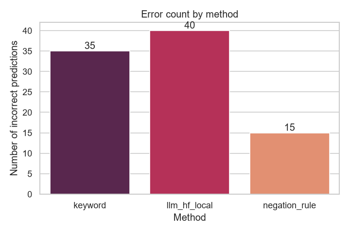
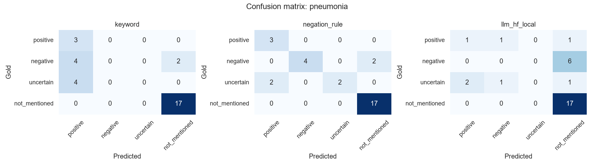

# Clinical NLP Radiology Report Labeling Mini-Benchmark

A small, reproducible clinical NLP benchmark for testing how different methods label chest-X-ray-style radiology reports.

It compares:

1. a keyword baseline,
2. a negation-aware rule-based labeler,
3. a local Hugging Face instruction model loaded with `transformers`.

The project uses only synthetic reports. No real clinical reports, no MIMIC-CXR files, no hosted APIs, and no API keys are used.

> This is not a clinical tool. The goal is to study the report-labeling problem and compare failure modes, not to make medical decisions.

---

## Why this project exists

Radiology reports often contain short phrases such as:

```text
No pleural effusion.
Pneumothorax cannot be excluded.
Findings suspicious for pneumonia.
```

A simple keyword search can detect the disease word, but it does not understand whether the finding is present, absent, or uncertain. That is the main problem this repo explores.

The benchmark asks:

> How do keyword-based, negation-aware, and local LLM-based methods behave when extracting pathology labels from reports with negation and uncertainty?

Pathologies:

```text
pneumonia, pleural_effusion, pneumothorax, cardiomegaly
```

Labels:

```text
positive, negative, uncertain, not_mentioned
```

---

## Methods

| Method | What it does | Main weakness |
|---|---|---|
| `keyword` | Checks whether pathology-related words appear | Cannot handle negation or uncertainty |
| `negation_rule` | Uses simple negation/uncertainty cues around pathology terms | Still misses phrasing outside the cue list |
| `llm_hf_local` | Runs a local Hugging Face instruction model and asks for JSON labels | Small models can be inconsistent on strict clinical-style extraction |
| `llm_mock` | Reuses the rule labeler so the repo runs without downloading a model | Not a real LLM result |

Default local model:

```text
Qwen/Qwen2.5-0.5B-Instruct
```

The default model is intentionally small so the full local-inference pipeline can run on a normal laptop. The goal is not to prove that LLMs always perform better, but to benchmark them against simpler and more interpretable baselines.

---

## Dataset

The dataset contains 30 synthetic chest-X-ray-style report snippets.

File:

```text
data/synthetic_demo_reports.csv
```

Columns:

```text
report_id, report_text, pneumonia_gold, pleural_effusion_gold,
pneumothorax_gold, cardiomegaly_gold
```

No real MIMIC-CXR / MIMIC-CXR-JPG data is included or redistributed.

---

## Latest run

The latest committed run used real local Hugging Face inference:

```text
config: configs/demo_hf_local.yaml
model:  Qwen/Qwen2.5-0.5B-Instruct
real_huggingface_used: true
fallback_mock_used: false
real_hf_calls: 30
```

Summary results:

| Method | Overall accuracy | Macro-F1 |
|---|:---:|:---:|
| `keyword` | 0.708 | 0.353 |
| `negation_rule` | 0.875 | 0.749 |
| `llm_hf_local` | 0.667 | 0.368 |

The rule-based labeler performs best on this small synthetic dataset. The local 0.5B Hugging Face model ran successfully, but it often confused `negative` with `not_mentioned`. This is a useful result: it shows why medical report labeling needs proper evaluation instead of assuming that an LLM will automatically outperform simpler methods.

Generated plots:









---

## What to look at first

For a quick review:

- `README.md` gives the project overview and latest result.
- `report/mini_report.md` gives a short research-style write-up.
- `experiments/results.csv` contains the metric table.
- `experiments/run_metadata.json` confirms whether the Hugging Face model really ran.
- `src/labelers/` contains the keyword, rule-based, and local LLM labelers.

---

## Quick start: run without downloading a model

```bash
pip install -r requirements.txt
python src/main.py --config configs/demo_mock.yaml
```

This runs the keyword, negation-rule, and mock LLM paths.

---

## Run local Hugging Face inference

See [`HUGGINGFACE_SETUP.md`](HUGGINGFACE_SETUP.md) for the full setup.

Short version:

```bash
pip install -r requirements.txt
python src/check_huggingface.py
python src/main.py --config configs/demo_hf_local.yaml
```

The first Hugging Face run downloads the model into your local Hugging Face cache. Later runs load it from cache.

To verify that the model really ran, open:

```text
experiments/run_metadata.json
```

For a real local model run, it should contain:

```json
"real_huggingface_used": true,
"fallback_mock_used": false
```

The method name in `experiments/results.csv` should be:

```text
llm_hf_local
```

---

## Outputs

Each run writes files under `experiments/`:

```text
experiments/predictions.csv
experiments/results.csv
experiments/error_analysis.csv
experiments/run_metadata.json
experiments/plots/
```

---

## Repository layout

```text
clinical-nlp-labeling-benchmark/
├── configs/
│   ├── demo_mock.yaml
│   ├── demo_hf_local.yaml
│   └── demo_hf_local_fallback.yaml
├── data/
│   └── synthetic_demo_reports.csv
├── experiments/
│   ├── results.csv
│   ├── predictions.csv
│   ├── error_analysis.csv
│   ├── run_metadata.json
│   └── plots/
├── report/
│   └── mini_report.md
├── src/
│   ├── main.py
│   ├── check_huggingface.py
│   ├── labelers/
│   ├── evaluation/
│   └── visualization/
├── HUGGINGFACE_SETUP.md
├── README.md
└── requirements.txt
```

---

## Limitations

- The dataset is small and synthetic.
- Results are for demonstration and method comparison only.
- The local LLM uses prompt-based inference, not fine-tuning.
- The rule-based method depends on fixed cue lists.
- The project is not clinically validated and is not a clinical tool.
- No real clinical/MIMIC data is included.

---

## Future work

Useful next steps would be:

- test a stronger local instruction model,
- improve the prompt with a few examples,
- compare against clinical NLP tools on approved datasets,
- study how label errors affect downstream chest X-ray classifiers,
- explore fine-tuning only after access to a properly annotated dataset.

For more detail, see [`report/mini_report.md`](report/mini_report.md).
